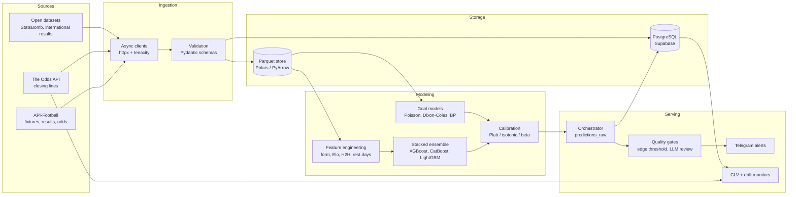

# Sports Forecasting Platform

[](https://github.com/Kevinbeltran123/sports-forecasting-platform/actions/workflows/ci.yml)


A data and machine-learning platform for probabilistic football (soccer) forecasting. It ingests fixtures, results and market odds from public APIs, validates and stores them in Parquet and PostgreSQL, trains gradient-boosting ensembles and statistical goal models under strict time-ordered validation, calibrates the predicted probabilities, and measures them out of sample with walk-forward backtests and closing-line comparisons. Predictions that pass configurable quality gates are delivered as alerts. It is a research project: everything is logged and evaluated, including the experiments that did not work.

## Key features

- **ETL and validation**: async API clients (API-Football, The Odds API, Sportmonks) with retries, Pydantic v2 schemas, Polars/PyArrow Parquet store, and PostgreSQL (Supabase) with versioned SQL migrations.
- **Leakage-safe training**: walk-forward cross-validation that asserts every training date precedes every test date, plus hand-rolled nested out-of-fold stacking so the meta-learner never sees future fixtures.
- **Model ensemble**: XGBoost, CatBoost and LightGBM base learners with a logistic-regression stacker for 1X2 and Over/Under markets in five European leagues.
- **Goal models for tournaments**: Elo, independent and bivariate Poisson, Dixon-Coles and diagonal-inflated bivariate Poisson predictors for international tournaments.
- **Probability calibration**: Platt scaling or isotonic regression chosen by sample size, beta and logit calibrators, per-market calibration maps, and ECE/Brier reporting.
- **Evaluation**: Brier score with bootstrap confidence intervals, classwise ECE, ablation studies, and closing-line value (CLV) tracked after each match with the bookmaker margin removed.
- **Reproducibility**: tournament predictions are frozen before kickoff in JSON "locks" carrying a SHA-256 content hash, so they can be scored honestly afterwards.
- **Orchestration and delivery**: APScheduler jobs, systemd unit with watchdog and heartbeat, drift and CLV-trend monitors, an optional LLM review step, and Telegram alerts.
- **Testing**: about 2,750 pytest test functions across ingestion, features, models, calibration, pipeline and delivery. External services are mocked.

## Architecture



## Data flow

1. **Ingest**: scheduled jobs pull fixtures, results and odds. Responses are validated against Pydantic models and appended to Parquet partitions; operational records go to PostgreSQL.
2. **Features**: rolling form, Elo ratings, head-to-head history, rest days, Dixon-Coles strength estimates, motivation flags and market-implied signals are built per fixture using only data available before kickoff.
3. **Train**: `python -m bip.train fit` runs walk-forward CV, nested OOF stacking and calibration, then writes versioned artifacts with metadata (log-loss before and after calibration, walk-forward CLV).
4. **Predict**: the orchestrator routes each fixture to the models that can handle it and stores calibrated probabilities in `predictions_raw`.
5. **Gate and deliver**: a prediction is forwarded only if the model's expected edge over the market price exceeds a threshold (5% by default, configurable per league and market). An optional LLM step can flag or reject it before the alert is sent.
6. **Measure**: after the match, closing odds are fetched, the bookmaker margin is removed, CLV is recorded, and drift and CLV-trend checks raise operational alerts.

## Models

| Scope | Models | Notes |
|---|---|---|
| Domestic leagues (EPL, La Liga, Bundesliga, Serie A, Ligue 1) | XGBoost + CatBoost + LightGBM, stacked with logistic regression | 1X2 and Over/Under; Platt below 500 samples, isotonic above |
| International tournaments | Elo-logistic, independent Poisson, bivariate Poisson, Dixon-Coles, diagonal-inflated BP | Weighted-MLE team strengths from historical international results |
| Live / in-play (experimental) | Game-state vectors, conditional predictors, OOD detector, drift monitor | Shadow mode only; not used for delivered alerts |

## Evaluation

Every number below is stored in a committed artifact. No league-model results are reported here because the trained models and their metadata are not committed.

**World Cup 2026 tournament model, out-of-sample** (`src/bip/evaluation/tournaments/locked_predictions/world_cup_2026/lock.json`): rolling-origin CV over AFCON 2023, Copa América 2024 and Euro 2024 (n = 135 matches), xG-blended bivariate Poisson with a post-hoc logit calibrator.

| Market | Brier | Classwise ECE |
|---|---|---|
| 1X2 | 0.2156 (95% CI 0.2027-0.2290) | 0.1074 |
| Both teams to score | 0.2542 | 0.1068 |
| Over/Under 2.5 goals | 0.2536 | 0.0931 |

The lock is marked `calibration_status: "below-gate"` because the pre-registered targets (1X2 Brier ≤ 0.21, ECE ≤ 0.05) were not met. It ships as is, so the result can be scored honestly after the tournament.

**Follow-up experiments** (`lock_v2.json`, `lock_v3.json`): adding the 2022 World Cup to the hold-out gave a 1X2 Brier of 0.2126 (95% CI 0.1938-0.2325). The change from the baseline is not statistically significant. Ablations of diagonal inflation, beta calibration, match-importance weighting, hierarchical Bayesian pooling and squad market value showed no significant improvement, so these experiments are recorded as negative results.

## Tech stack

Python 3.12, uv, Polars, PyArrow, NumPy, SciPy, scikit-learn 1.8, XGBoost, CatBoost, LightGBM, penaltyblog, PyMC/NumPyro, Pydantic v2, httpx, tenacity, APScheduler, Supabase/PostgreSQL (psycopg), structlog, Typer, python-telegram-bot, Anthropic SDK (optional LLM review), pytest, Ruff, GitHub Actions, systemd.

## Quickstart

```bash
git clone https://github.com/Kevinbeltran123/sports-forecasting-platform.git
cd sports-forecasting-platform

# with uv (recommended)
uv sync --extra dev
cp env.example .env          # fill in your own keys; .env is gitignored

# or with pip
python -m venv .venv && source .venv/bin/activate
pip install -e ".[dev]"
```

Run the pipeline end to end with stubbed dependencies (no keys or network needed):

```bash
uv run python -m bip.pipeline --dry-run
```

Train and backtest a league model (requires API keys and seeded historical data):

```bash
uv run python scripts/seed_historical.py --help
uv run python -m bip.train fit --help
```

Apply the database schema with the Supabase CLI (`supabase db push`) or by running the files in `supabase/migrations/` in order. Production deployment notes are in [deploy/README.md](deploy/README.md).

## Running tests

```bash
uv run ruff check .
uv run pytest -m "not requires_data"
```

Tests marked `requires_data` need public datasets (international results, StatsBomb open data) downloaded locally into `data/cache/`, so CI skips them. The rest of the suite runs offline without credentials.

## Project structure

```
src/bip/
  core/          settings, storage (Parquet + Supabase), pick engine, LLM validator, Telegram
  sports/        sport plugins: football API clients, features, league configs
  train/         walk-forward CV, stacking, calibration, backtest, model registry, CLI
  models/        model registry entries: domestic leagues and tournament lock wrapper
  pipeline/      orchestrator, delivery and CLV workers, scheduler
  clv/           closing-odds client, margin removal, CLV recorder, trend checker
  evaluation/    tournament predictors, calibration metrics, backtests, live engine (experimental)
  production/    production entrypoint, heartbeat, drift checks
scripts/         data seeding, backtests, migration checks, smoke tests
supabase/        SQL migrations
deploy/          systemd unit, install script, runbooks
tests/           pytest suite mirroring src/
data/calibration/  fitted calibration maps (JSON)
```

## Disclaimer

This project is for educational and research purposes. It studies probabilistic forecasting, calibration and model evaluation. It is not financial or betting advice, and nothing in it suggests that wagering is profitable. If you use sports data or odds providers, follow their terms of service and your local laws.

## License

[MIT](LICENSE) © 2026 Kevin Hernando Beltrán Martínez
